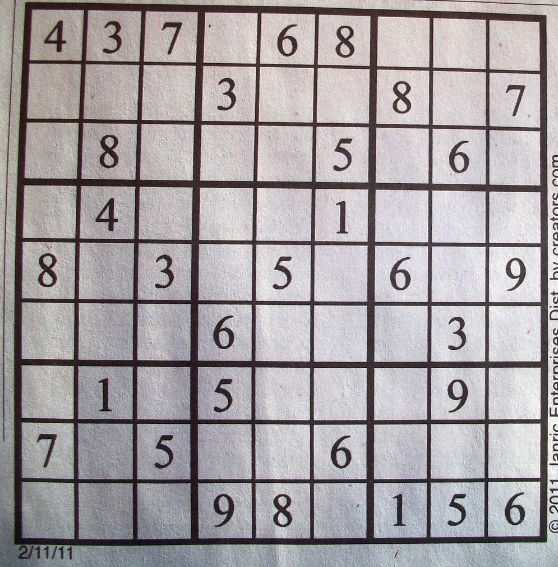

# Machine Learning Sudoku Solver

### Summary
This project attempts to read a sudoku puzzle from an photograph using PyTorch and the MNIST dataset, and solves the resulting puzzle.

### Details
* boardRecognition.py uses the cv2 library to apply preprocessing on the sudoku puzzle image, determines which cells are empty, and constructs a skeleton of the puzzle structure.
* interpretDigits.py constructs a neural network using PyTorch and the MNIST dataset, and recognizes each number in the tile images
* sudokuSolver.py solves the interpreted sudoku puzzle using a simple backtracking algorithm

Here's the photograph of the sudoku puzzle I used for testing

After applying image preprocessing...

Recognizing the 3 in the second tile

Solving the sudoku puzzle

Original input and final output

